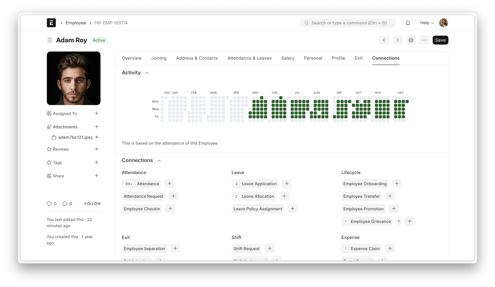
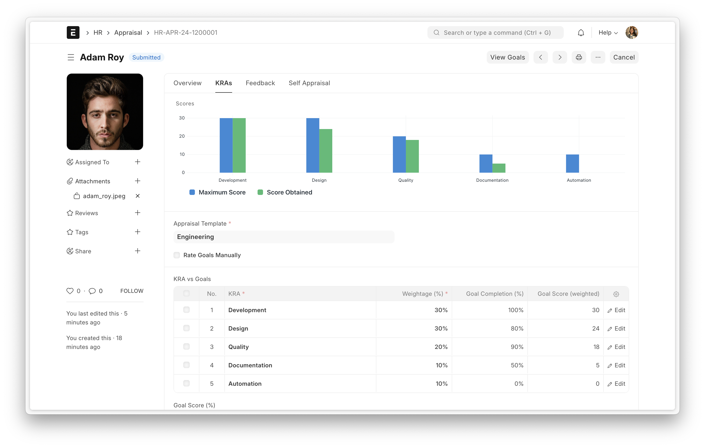
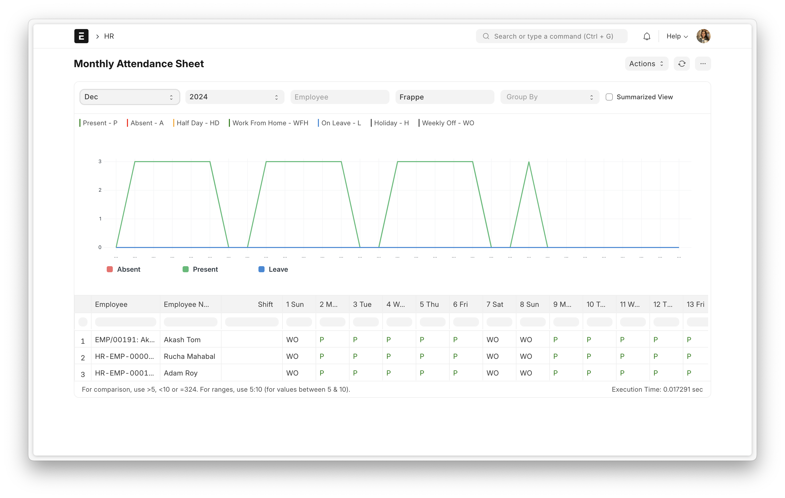
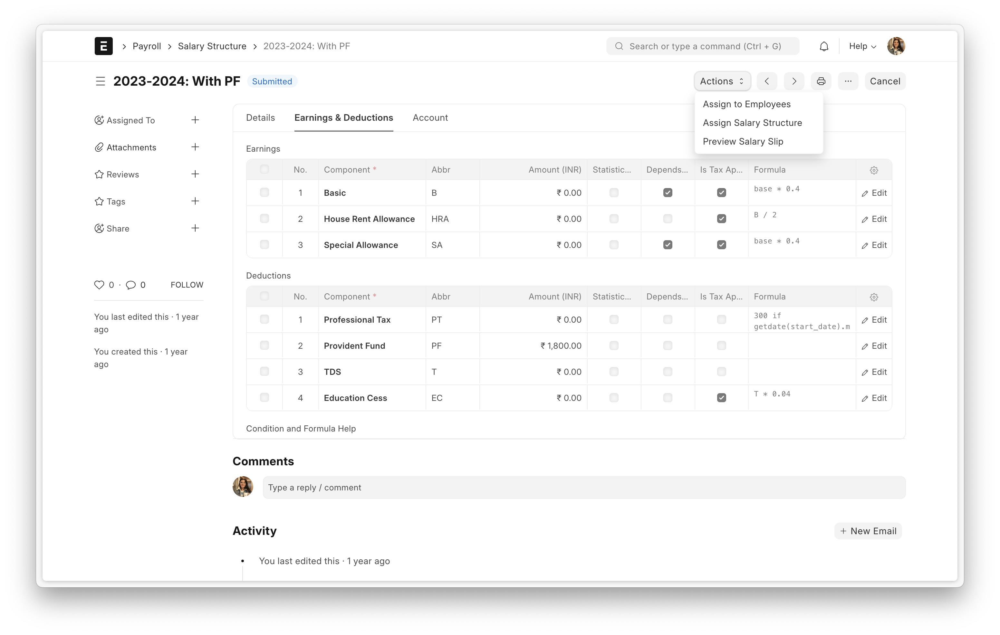
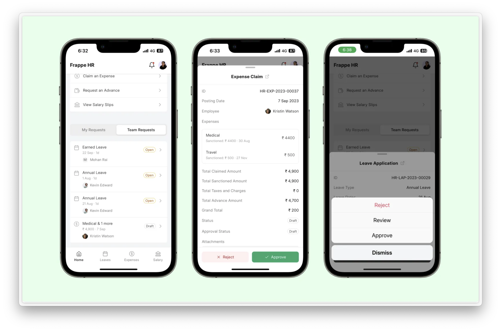

# bERP-HRMS

The **HRMS application of the bERP platform** — a downstream copy of
[frappe/hrms](https://github.com/frappe/hrms), carrying its full upstream history.

It installs into a bench as **`berp_hrms`**, not as `hrms`. That rename, the
substitution rule behind it, and the in-place migration for a site that already
has `hrms` installed are in
[docs/RENAME_TO_BERP_HRMS.md](docs/RENAME_TO_BERP_HRMS.md).

## Where this sits

bERP is assembled two different ways, and this repository belongs to one of them.

**The development bench** — what `scripts/install-berp-apps.sh` builds, and where
this module is installed:

| App | Repository | Role |
|---|---|---|
| `frappe` | [frappe/frappe](https://github.com/frappe/frappe) `develop` | Framework |
| `erpnext` | [bstBizEra/bERP](https://github.com/bstBizEra/bERP) | Platform — **bERP is ERPNext** |
| **`berp_hrms`** | **this repository** | **HR and Payroll** |
| `crm` | [bstBizEra/bERP-CRM](https://github.com/bstBizEra/bERP-CRM) | CRM |
| `berp_branding` | inside `bERP` | Branding |
| `berp_lao` | inside `bERP` | Lao localisation |

`bstBizEra/bERP` is a fork of ERPNext whose `pyproject.toml` declares
`name = "erpnext"`, so on this bench it occupies the `erpnext` app slot and
upstream `frappe/erpnext` is not installed beside it — they are the same app.
Everything above is `17.0.0-dev`.

**The tenant bench** — what customers run, built by `berp_deploy.sh` in
`bstBizEra/bERP` — **does not hold this module.** It runs released `frappe` v16,
**upstream** `frappe/erpnext` v16 and **upstream** `frappe/hrms` pinned at
`version-16`, with `berp_branding` and `berp_lao` on top. That repository's
[`scripts/deploy/README.md`](https://github.com/bstBizEra/bERP/blob/dev/scripts/deploy/README.md)
says it directly: *"The ERPNext tree in this repository is 17.0.0-dev. The
tenants run the released v16 line."*

So a change made here does not reach a customer until the platform's tenant line
moves to this module. [`NOTICE`](NOTICE) carries the version bounds and why the
develop lane is the only one installable on the development bench.

`berp_hrms` also depends on it: `hooks.py` declares
`required_apps = ["frappe/erpnext"]`, and roughly 108 modules import `erpnext`
directly.

## Running it

| You want | Read |
|---|---|
| A workstation checkout | [docs/LOCAL_SETUP.md](docs/LOCAL_SETUP.md) |
| A private dev VM, reached over an SSH tunnel | [docs/DEPLOYMENT_DEV.md](docs/DEPLOYMENT_DEV.md) |
| A public VM with nginx and TLS | [docs/DEPLOYMENT.md](docs/DEPLOYMENT.md) |

```bash
sudo ./scripts/deploy-dev.sh          # private development VM
sudo ./scripts/setup-bench.sh         # bench only, no deployment layer
```

| Script | Purpose |
|---|---|
| `scripts/setup-bench.sh` | System packages, MariaDB, Node 24, Python 3.14, `bench init` |
| `scripts/install-berp-apps.sh` | Shared app assembly — used by both deployment scripts so they cannot drift |
| `scripts/deploy-dev.sh` | Private VM: no nginx, no TLS, firewall allows SSH only |
| `scripts/deploy-production.sh` | Public VM: nginx, Let's Encrypt, requires an explicit `BERP_BRANCH` |

The toolchain pins are load-bearing — **Python 3.14** and **Node ≥ 24** — and are
hard failures with Ubuntu 24.04 defaults. `pyproject.toml` below advertises
`requires-python = ">=3.10"`; that value is inherited from upstream and is
misleading, because the framework this depends on will not build below 3.14.
[docs/LOCAL_SETUP.md](docs/LOCAL_SETUP.md#toolchain-requirements) has the detail.

## Upstream

- **Source:** https://github.com/frappe/hrms (branch `develop`)
- **Imported at:** upstream commit [`32a4d0097`](https://github.com/frappe/hrms/commit/32a4d0097)
- **Attribution and modification log:** [`NOTICE`](NOTICE) — the exact upstream commit, the
  `frappe-ui` submodule pin, why this module tracks the develop lane rather than upstream's
  stable one, and every file bERP added, removed or changed.

Full upstream history is preserved, so the merge base is real:

```bash
git remote add upstream https://github.com/frappe/hrms.git   # one-time
git fetch upstream develop
git merge upstream/develop
```

Since the app is named `berp_hrms` and upstream's is `hrms`, that merge
conflicts across the tree rather than applying cleanly. Resolving it means
re-applying the rename to the incoming side;
[docs/RENAME_TO_BERP_HRMS.md](docs/RENAME_TO_BERP_HRMS.md#the-substitution-rule)
records the exact rule so every sync reproduces it instead of inventing one.

Do that on a branch and let it go through review — never merge upstream directly
on a server.

## Security

Static-analysis findings inherited from the upstream import are triaged separately from
findings introduced by bERP's own changes. The policy, and an inventory of the imported
tree, are in [`docs/SECURITY-BASELINE.md`](docs/SECURITY-BASELINE.md); triage is tracked in
[#7](https://github.com/bstBizEra/bERP-HRMS/issues/7).

Note that `semgrep ci` baselines against a pull request's base branch, so **a passing
`Frappe Linter` check means no *new* findings, not a clean tree.**

## Licence

GNU General Public License v3 — see [`license.txt`](license.txt). Copyright
remains with Frappe Technologies Pvt. Ltd. and the upstream contributors, and any
derivative work here remains GPL-3.0 licensed. GPL-3.0 is strong copyleft rather
than permissive: distributing a derivative obliges you to offer its source.

---

*Upstream's README follows unchanged. Its badges and links describe the Frappe HR
project and reflect upstream's CI, not this repository's.*

---

<div align="center">
	<a href="https://frappe.io/hr">
		
	</a>
	<h2>Frappe HR</h2>
	<p align="center">
		<p>Open Source, modern, and easy-to-use HR and Payroll Software</p>
	</p>

[](https://github.com/frappe/hrms/actions/workflows/ci.yml)
[](https://codecov.io/gh/frappe/hrms)

<a href="https://trendshift.io/repositories/10972" target="_blank"></a>
</div>

<div align="center">
	
</div>

<div align="center">
	<a href="https://frappe.io/hr">Website</a>
	-
	<a href="https://docs.frappe.io/hr/introduction">Documentation</a>
</div>

## Frappe HR

Frappe HR has everything you need to drive excellence within the company. It's a complete HRMS solution with over 13 different modules right from Employee Management, Onboarding, Leaves, to Payroll, Taxation, and more!

## Motivation
When Frappe team started growing in terms of size, we needed an open-source HR and Payroll software. We didn't find any "true" open-source HR software out there and so decided to build one ourselves.
Initially, it was a set of modules within ERPNext but version 14 onwards, as the modules became more mature, Frappe HR was created as a separate product.

## Key Features

- **Employee Lifecycle**: From onboarding employees, managing promotions and transfers, all the way to documenting feedback with exit interviews, make life easier for employees throughout their life cycle.
- **Leave and Attendance**: Configure leave policies, pull regional holidays with a click, check-in and check-out with geolocation capturing, track leave balances and attendance with reports.
- **Expense Claims and Advances**: Manage employee advances, claim expenses, configure multi-level approval workflows, all this with seamless integration with ERPNext accounting.
- **Performance Management**: Track goals, align goals with key result areas (KRAs), enable employees to evaluate themselves, make managing appraisal cycles easy.
- **Payroll & Taxation**: Create salary structures, configure income tax slabs, run standard payroll, accommodate additional salaries and off cycle payments, view income breakup on salary slips and so much more.
- **Frappe HR Mobile App**: Apply for and approve leaves on the go, check-in and check-out, access employee profile right from the mobile app.

<details open>

<summary>View Screenshots</summary>
	
	
	
	
	
</details>

### Under the Hood

- [**Frappe Framework**](https://github.com/frappe/frappe): A full-stack web application framework written in Python and Javascript. The framework provides a robust foundation for building web applications, including a database abstraction layer, user authentication, and a REST API.

- [**Frappe UI**](https://github.com/frappe/frappe-ui): A Vue-based UI library, to provide a modern user interface. The Frappe UI library provides a variety of components that can be used to build single-page applications on top of the Frappe Framework.

## Production Setup

### Managed Hosting

You can try [Frappe Cloud](https://frappecloud.com), a simple, user-friendly and sophisticated [open-source](https://github.com/frappe/press) platform to host Frappe applications with peace of mind.

It takes care of installation, setup, upgrades, monitoring, maintenance and support of your Frappe deployments. It is a fully featured developer platform with an ability to manage and control multiple Frappe deployments.

<div>
	<a href="https://frappecloud.com/hrms/signup" target="_blank">
		<picture>
			<source media="(prefers-color-scheme: dark)" srcset="https://frappe.io/files/try-on-fc-white.png">
			
		</picture>
	</a>
</div>


## Development setup
### Docker
You need Docker, docker-compose and git setup on your machine. Refer [Docker documentation](https://docs.docker.com/). After that, run the following commands:
```
git clone https://github.com/frappe/hrms
cd hrms/docker
docker-compose up
```

Wait for some time until the setup script creates a site. After that you can access `http://localhost:8000` in your browser and the login screen for HR should show up.

Use the following credentials to log in:

- Username: `Administrator`
- Password: `admin`

### Local

1. Set up bench by following the [Installation Steps](https://frappeframework.com/docs/user/en/installation) and start the server and keep it running
	```sh
	$ bench start
	```
2. In a separate terminal window, run the following commands
	```sh
	$ bench new-site hrms.localhost
	$ bench get-app erpnext
	$ bench get-app hrms
	$ bench --site hrms.localhost install-app hrms
	$ bench --site hrms.localhost add-to-hosts
	```
3. You can access the site at `http://hrms.localhost:8080`

## Learning and Community

1. [Frappe School](https://frappe.school) - Learn Frappe Framework and ERPNext from the various courses by the maintainers or from the community.
2. [Documentation](https://docs.frappe.io/hr) - Extensive documentation for Frappe HR.
3. [User Forum](https://discuss.erpnext.com/) - Engage with the community of ERPNext users and service providers.
4. [Telegram Group](https://t.me/frappehr) - Get instant help from the community of users.


## Contributing

1. [Issue Guidelines](https://github.com/frappe/erpnext/wiki/Issue-Guidelines)
1. [Report Security Vulnerabilities](https://erpnext.com/security)
1. [Pull Request Requirements](https://github.com/frappe/erpnext/wiki/Contribution-Guidelines)


## Logo and Trademark Policy

Please read our [Logo and Trademark Policy](TRADEMARK_POLICY.md).

<br />
<br />
<div align="center" style="padding-top: 0.75rem;">
	<a href="https://frappe.io" target="_blank">
		<picture>
			<source media="(prefers-color-scheme: dark)" srcset="https://frappe.io/files/Frappe-white.png">
			
		</picture>
	</a>
</div>

